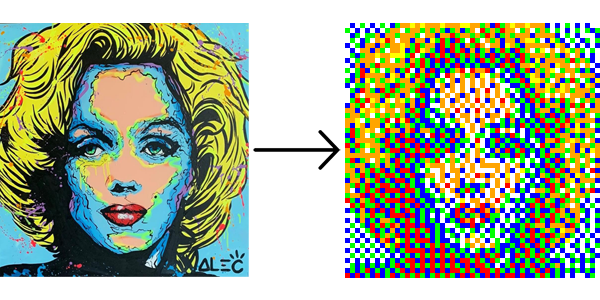
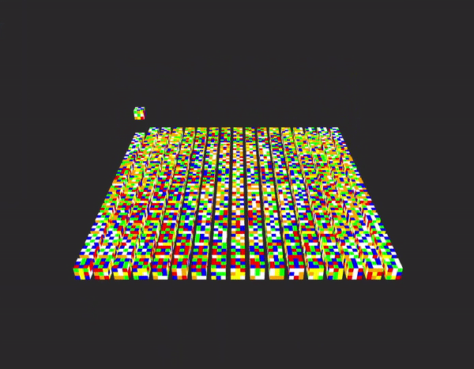
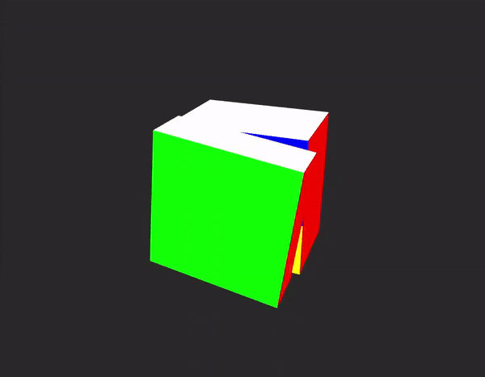

# Tessellate

The minimalistic Rubik's Cube mosaic generator written in C++.

## Contents
- [About](#about)
  - [Technologies](#technologies)
- [Features](#features)
  - [Image conversion](#ic)
  - [Mosaic solver](#mosaic)
  - [Individual cube control](#individual-control)
  - [Camera Settings](#camera)
    - [Bird's Eye](#birds-eye)
    - [Focus Mode](#focus-mode)
- [Usage](#usage)
  - [CLI vs GUI](#cli-v-gui)
  - [Keybinds](#keybinds)
- [Examples](#examples)

##  About
*Have you ever seen a Rubik's Cube mosaic?*

*Y'know, these?*

**Tessellate** is a program for Windows that displays a grid of 3D, graphical Rubik's Cubes. The cubes solve themselves in order to display a supplied image in low (or if your CPU can handle it, medium) resolution.

###  Technologies

It was my goal to create **Tessellate** without the aid of huge image libraries. The project served as my first time working with 3D graphics, and I wanted to create each part of the process, from vertex shaders to a custom BMP image loader.

That said, in order to fully realize **Tessellate**, I needed to take advantage of a few external libraries and resources.

These include:
- <a href="https://github.com/python-pillow/Pillow">Pillow</a> to resize input images and convert between file types
- <a href="https://github.com/g-truc/glm">GLM</a>, a lightweight math library for OpenGL
- <a href="https://github.com/glfw/glfw">GLFW</a>, an OpenGL library that handles windowing and input
- <a href="https://github.com/nigels-com/glew">GLEW</a>, the OpenGL Extension Wrangler Library

##  Features
###  Image conversion
**Tessellate** reads a supplied bitmap image file (.BMP) to properly arrange the grid of cubes. If you wish to display another file type, *dithering.py* will downsample, apply dither, and convert an image to .BMP format.
</img>

In the diagram above, Marilyn Monroe (.PNG) is downsampled to an efficient resolution (lower res = faster calculations) and converted into the bitmap image file type (.BMP).

Due to the Rubik's Cube's limited color palette, the image is also manipulated by the <a href="Floyd–Steinberg dithering">Floyd–Steinberg dithering algorithm</a> to maintain as much resemblence to the original as possible.

###  Mosaic solver
</img>

In the .GIF above, 289 cubes calculate the most efficient set of moves to display their respective patterns. Immediately after calculating, the cubes begin simultaneously solving for the image.

###  Individual cube control
</img>

Pick a cube and control its faces manually, or optionally avoid the grid altogether.

</img>

Grow your solving skills with fast, easy to learn software. Testing an algorithm? Enter a series of legal moves. **Tesselate** understands [Singmaster](https://en.wikipedia.org/wiki/David_Singmaster) notation!
 
###  Camera Settings
####  Bird's Eye
</img>

*View the action from above...*

####  Focus Mode
</img>

*...or down low.*
